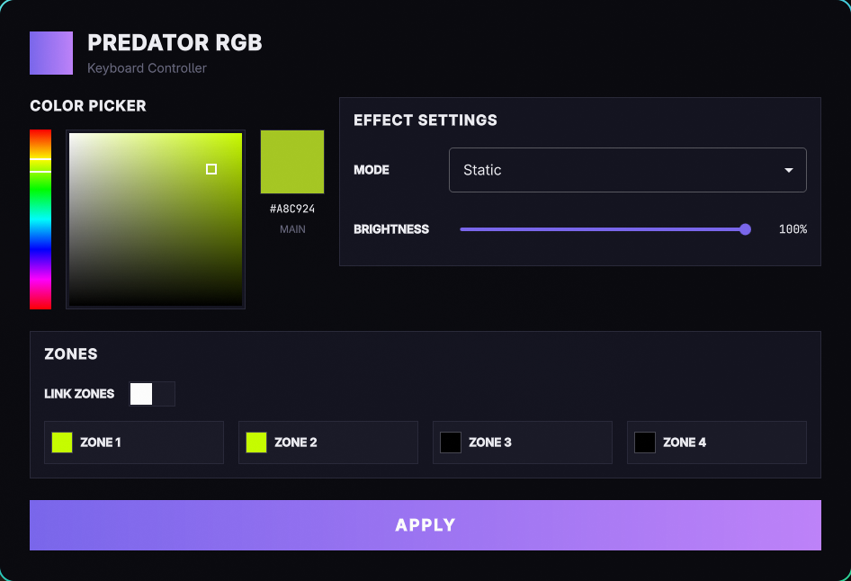
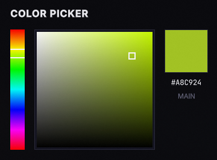
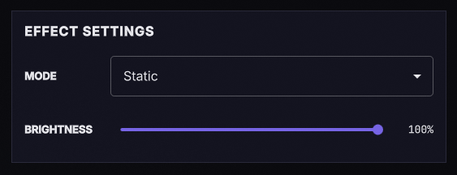
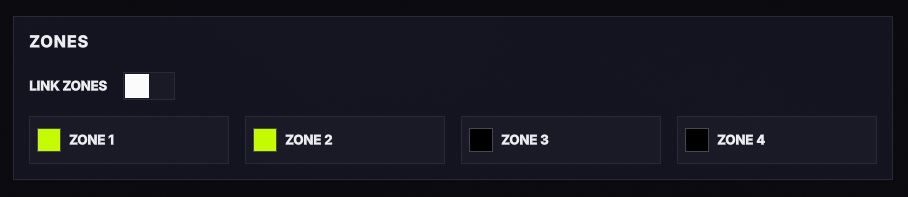

# Predator RGB — User Manual

RGB keyboard controller for the **Acer Predator Helios Neo 16**.

---

## Table of Contents

- [Requirements](#requirements)
- [Installation](#installation)
- [Quick Start](#quick-start)
- [Interface Overview](#interface-overview)
- [Changing Colors](#changing-colors)
- [Effect Modes](#effect-modes)
- [Zone Control](#zone-control)
- [Applying Settings](#applying-settings)
- [Saving and Restoring](#saving-and-restoring)
- [Troubleshooting](#troubleshooting)

---

## Requirements

- Linux operating system
- The `acer-gkbbl` kernel module must be loaded (this is what lets the app talk to your keyboard)
- Qt6 runtime libraries

## Installation

### Building from source

Open a terminal and run:

```sh
cmake -B build -DCMAKE_BUILD_TYPE=Release
cmake --build build -j$(nproc)
```

The compiled application will be at `build/app/predator-rgb`.

### Running

```sh
./build/app/predator-rgb
```

You can also run it from your desktop's application launcher if you install it properly.

---

## Interface Overview

The application has a dark themed interface with these main areas:



| Area | What it does |
|------|--------------|
| **Color Picker** | Choose the color for your keyboard (left side) |
| **Effect Settings** | Pick the animation mode, speed, brightness, and direction (right side) |
| **Zone Selector** | Choose which part of the keyboard to color (only in Static mode) |
| **APPLY Button** | Sends your settings to the keyboard |

---

## Changing Colors

### Using the Color Picker



1. **Hue Slider** (the rainbow bar on the left): Click or drag to pick the base color
2. **Saturation/Value Box** (the big square): Click or drag to adjust how vivid and bright the color is
   - Left = less saturated (more gray)
   - Right = more saturated (more vivid)
   - Top = brighter
   - Bottom = darker
3. The **preview square** on the right shows your selected color
4. The **hex code** (e.g. `#FF3D7E`) is displayed below the preview

### Typing a hex code

You can also enter a hex color code directly if you know the exact color you want.

---

## Effect Modes

Open the **Effect Settings** panel to change the keyboard animation.



### Available Modes

| Mode | Description |
|------|-------------|
| **Static** | Solid color, no animation. You can set different colors for each zone. |
| **Breath** | Gentle pulsing/breathing effect |
| **Neon** | Color cycling with a neon feel |
| **Wave** | Color wave that moves across the keyboard |
| **Shifting** | Color shifting animation |
| **Zoom** | Zoom-based color animation |

### Speed

Controls how fast the animation plays (1 = slowest, 10 = fastest). Not available in Static mode.

### Brightness

Controls the overall brightness of the keyboard LEDs (0% = off, 100% = maximum).

### Direction

For Wave, Shifting, and Zoom modes, you can choose:
- **Left to Right**
- **Right to Left**

---

## Zone Control

The keyboard is divided into **4 independent zones**. You can control them separately in Static mode.



### Link Zones

When **LINK ZONES** is ON (default), all 4 zones use the same color. Pick any color and all zones update together.

When **LINK ZONES** is OFF, each zone can have its own color:

1. Toggle the link switch to OFF
2. Click on the zone you want to edit (ZONE 1, ZONE 2, ZONE 3, or ZONE 4)
3. The selected zone will be highlighted
4. Use the color picker to choose a color for that zone
5. Repeat for each zone

### Zone Layout

| Zone | Area |
|------|------|
| Zone 1 | Left section of the keyboard |
| Zone 2 | Center-left section |
| Zone 3 | Center-right section |
| Zone 4 | Right section (numpad area) |

> **Note:** Zone control is only available in **Static** mode. In other modes, the keyboard uses a single color for the animation.

---

## Applying Settings

After choosing your color and effect settings:

1. Click the **APPLY** button at the bottom of the window
2. The button will turn **green** if the settings were applied successfully
3. The button will turn **red** if there was an error (e.g. the keyboard device is not accessible)

    

    

---

## Saving and Restoring

Your settings are **automatically saved** every time you change something. When you open the application again, it will restore your last used configuration.

Settings are stored in:
```
~/.config/predator-rgb/config.json
```

---

## Troubleshooting

### "Error" when applying

- Make sure the `acer-gkbbl` kernel module is loaded:
  ```sh
  lsmod | grep acer
  ```
- Check that the device files exist:
  ```sh
  ls -l /dev/acer-gkbbl-0 /dev/acer-gkbbl-static-0
  ```
- You may need to run with `sudo` or have the appropriate permissions

### Keyboard doesn't respond

- Verify the kernel module is loaded (see above)
- Try unplugging and replugging an external keyboard if applicable
- Restart the application

### Application doesn't start

- Make sure Qt6 libraries are installed:
  ```sh
  # Ubuntu/Debian
  sudo apt install qt6-base-dev qt6-declarative-dev libqt6quickcontrols2-6
  
  # Arch Linux
  sudo pacman -S qt6-base qt6-declarative
  ```

---

## Getting Help

If you find a bug or have a feature request, please open an issue at:
[https://github.com/skvggor/predator-rgb/issues](https://github.com/skvggor/predator-rgb/issues)
